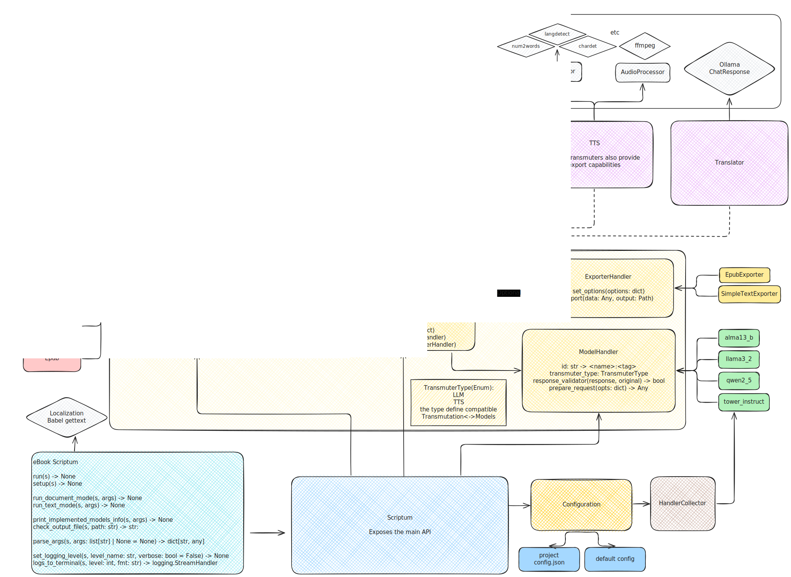

# eBook Scriptum 📚✨

> _A collection of tools to transform eBooks into audio, translations, and more
> using IA and other processors_ 🎧🌍

## Description

eBook Scriptum is a versatile modular tool for processing and converting
text-based documents into various formats. By design, it supports multiple
optional transformations to the imported documents, such as AI-driven
translation or text-to-speech audio generation.

eBook Importer uses three interchangeable main components:

- An Importer: Used to import a supported file format into an inner Document.
- A Transformer: Used to transform the inner Document (e.g., translations, tts).
- An Exporter: Used to export the inner Document into a supported file format.

Multiple transformations can be applied in a single transmutation process, for
example, translating the eBook and then converting it into translated mp3 audio
files.

All these modules could be fine-tuned to apply specific configurations through a
single `config.json` file located in the same directory as the source file.

### Screenshot

TODO

## TODO/ROADMAP

- [ ] CLI (Command Line Interface)
- [ ] GUI (Web and/or QT)

## Requirements

- Python >= 3.12
- venv
- inquirer
- ollama
- coqui-tts

## Usage

### Python script example:

```python
#!/usr/bin/env python
# -*- coding: utf-8 -*-


from src.scriptorium import Scriptorium

opts = {
    "selection": [
        "Section0001.xhtml",
        "Section0002.xhtml",
        "Section0003.xhtml",
    ],
    "input": "files/ebook.epub",
    "output": "files/ebook/",
    "transmuter": ("CoquiTTS", "ModelVittsEs"),
    "importer": "EpubImporter",
    "exporter_opts": {
        "lang": "es",
        "log": "files/logs",
        "word_dict": {
            "UN": "United Nations",
        },
    },
}

scriptum = Scriptorium()
scriptum.setup(opts)
scriptum.load_data()
scriptum.transmute()
scriptum.export()
```

### Python script + `config.json` file example:

Inside `path/to/book/`:

`config.json`:

```json
{
  "input": "path/to/book/ebook.epub",
  "output": "target/path/",
  "importer": "EbookImporter",
  "exporter": "EpubExporter",
  "transmuter": ["OllamaTranslator", "ModelLlama3_2"],
  "metadata": {
    "title": "Título personalizado",
    "creator": "Anónimo",
    "lang": "es"
  }
}
```

```python
#!/usr/bin/env python
# -*- coding: utf-8 -*-

import Scriptorium

scriptum = Scriptorium()
scriptum.setup({"input": "path/to/ebook.epub"})
scriptum.load_data()
scriptum.transmute()
scriptum.export()
```

## Installation

### On the system

```terminal
$ git clone git@github.com:polirritmico/ebook-scriptum.git
$ python -m venv .venv
$ source .venv/bin/activate
$ python -m pip install -r requirements.txt
```

### Docker

```terminal
docker build --tag ebook-scriptum:lattest .
docker run -it --cap-add=SYS_PTRACE --security-opt seccomp=unconfined --device=/dev/kfd --device=/dev/dri --group-add video --ipc=host --shm-size 8G --name scriptum -v $(shell pwd):/ebook-scriptum rocm-ebook-scriptum
```

## Configuration

TODO

## AMD

To remove annoying Rocm warnings try this:

```python
import os

# HACK: Hide a LOT of useless rocm warnings (for AMD RDNA2 GPUs)
os.environ["MIOPEN_LOG_LEVEL"] = "3"
```

---

## Design

### Architecture

[Diagram](./docs.svg) 
